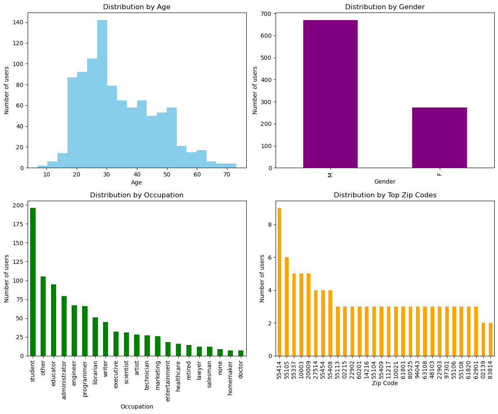
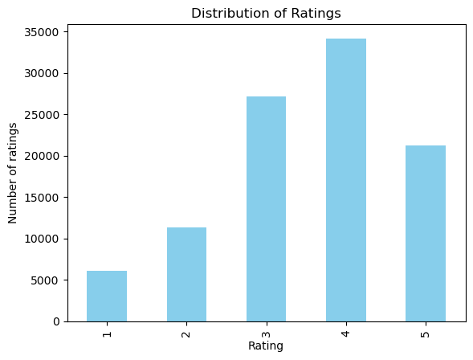
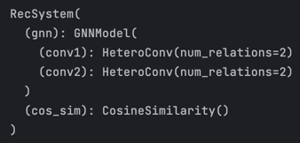
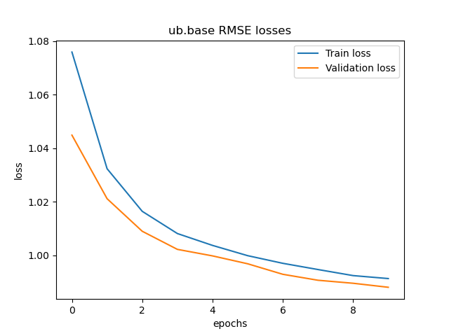
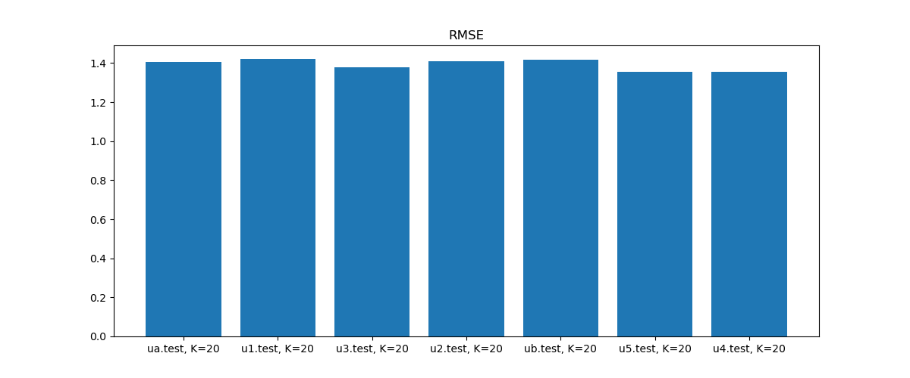

# Final Report.

## Data Analysis

To start with, I analyzed the provided dataset to get a better understanding of movie/user distribution and ratings.

The following plot shows how users are distributed from different angles:



Some interesting observations:

- Most of the users are students. It is also clearly shown on the distribution of age.
- The distribution by gender is around 70/30 for male/female.
- It seems that the geographical distribution is very sparse. This is good for representing users by their geographical
  location.

Let's look at one more plot, which is the distribution of ratings:



It looks like normal distribution! So, we can conclude the dataset reflects the real world.

## Data Preprocessing

To prepare the data for training, I did the following steps:

1. **User data**:
    1. Columns `gender` and `occupation` are categorical features. I used one-hot encoding to convert them to numerical
       features.
    2. `age` column was normalized to be in the range of [0, 1].
2. **Movie data**: I used only the genre of film as a feature. This column was also encoded using one-hot encoding.
3. **Rating data**: Using the provided train/test split of the dataset, I create bipartite graph. Each user is
   connected to the movies he/she rated. The edge weight is the rating value. This graph is used for training the
   model.

## Model Specification and Training

The model is based on the **Graph Convolutional Network**. It is a neural network that operates on graphs. The main idea
is to use the graph structure to improve the performance of the model.

The model architecture looks like this:



THe **GNN model** here consists of two Convolutional layers. It is responsible for learning the user and movie
embeddings.

The next part is **cosine similarity**. It calculates the similarity between user and movie embeddings. The output of
this
layer is then scaled to the range of [1, 5].

The whole RecSystem is trained end-to-end using **MSE loss** and **Adam optimizer** with default parameters for 10
epochs. Training was performed separately for each fold of the dataset.

Here is the example loss plot for **ub.base fold**:



## Evaluation

The final model was evaluated using several metrics: **RMSE**, **Precision**, **Recall**, **NDCG**.

Here are the values averaged over all folds:

```
Precision@20 = 0.588

Recall@20    = 0.838

NDCG@20      = 0.748

RMSE         = 1.390
```

For the main metric I chose **RMSE**. It is the most common metric for evaluating the performance of the recommender
system.

The plot of RMSE for each fold is shown below:



## Conclusion

The constructed Recommendation System based on Graph Neural Network performs well on the provided dataset.

Interestingly, the model has high recall and low precision. It means that the model can recommend a lot of movies that
the user will like, but they may not be the best recommendations.

User and Movie Embeddings, learned by the model, can be used for other tasks, such as clustering, classification, etc.